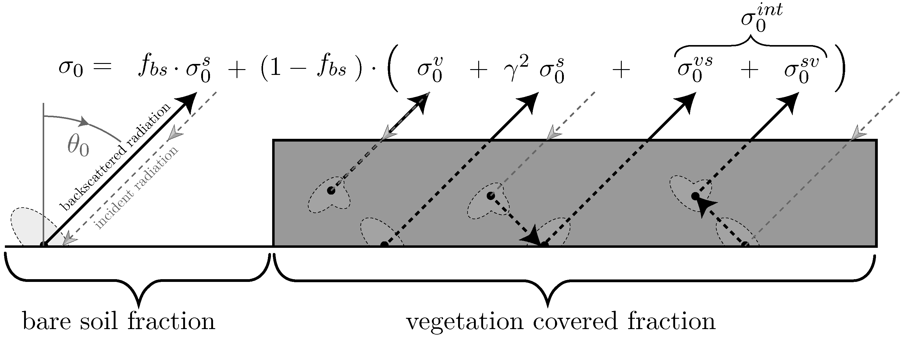

RT1 model documentation
-----------------------

Welcome to the documentation for the **RT1 python package**!

The ``rt1_model`` package is a ``python`` implementation for the RT1 bistatic (first order) scattering radiative transfer model as described in :cite:t:`Quast2016` :cite:t:`Quast2019`.
that can be used to simulate the scattered radiation from a rough surface covered by a tenuous distribution of particulate media.

RT1 hereby provies a flexible framework to parameterize the scattering properties of the surface and volume layer via bistatic distribution functions.

The ``rt1_model`` package provides the following core features:

- An object-oriented interface to easily setup, evaluate and analyze RT1 model specifications.
- An (extensible) set of volume- and surface scattering distribution functions and capabilities to use arbitrary linear combinations thereof.
- Fast numeric evaluation of the model up to first order (e.g. double-bounce) contributions.
- Capabilities to evaluate the Jacobian with respect to arbitrary model parameters (for model parameter optimization).

   Illustration of the scattering contributions considered in the RT1 model (from :cite:p:`Quast2023`)

.. note::

   `RT1` is provided as open-source software, hoping that it will help you in your research.
   The developers would very much appreciate to receive feedback how the model is used. Also contributions and suggestions for further improvements are highly welcome.

   Please read the `LICENSE <https://github.com/TUW-GEO/rt1_model/blob/master/LICENSE>`_ agreement related to this software which gives you much flexibility to (re)use the code. Currently we use the APACHE-2.0 license.

   When you are using `RT1` as part of your publications, please give the developers credit by giving reference to the `GitHub repository <https://github.com/TUW-GEO/rt1_model>`_ and to the papers :cite:t:`Quast2016`,  :cite:t:`Quast2019`:

   Additional information on how to use the RT1 model for soil-moisture retrievals can be found in :cite:t:`Quast2023`:

.. raw:: html

   

.. bibliography::
   :filter: docname in docnames

.. toctree::
   :hidden:
   :maxdepth: 1
   :caption: General

   installation
   contribution_guide

.. toctree::
   :hidden:
   :maxdepth: 1
   :caption: Usage

   theory
   model_specification
   examples

.. toctree::
   :hidden:
   :maxdepth: 1
   :caption: API Reference

   api_reference
