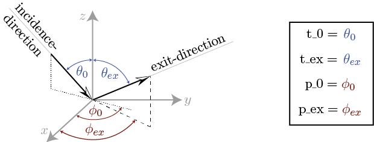

.. _cha_model_specification:

Model Specification
====================

Evaluation Geometries
----------------------
.. role:: latex(raw)
   :format: latex

.. currentmodule:: rt1_model

In order to calculate first order corrections with respect to the chosen scattering distributions, the so-called fn-coefficients have to be evaluated.
From the general definition of the fn-coefficients :eq:`fn_coef_definition` it is apparent that they are in principle dependent on :math:`\theta_0,\phi_0,\theta_{ex}` and :math:`\phi_{ex}`.
If the series-expansions (:eq:`brdf_expansion` and :eq:`p_expansion`) contain a high number of Legendre-polynomials, the resulting fn-coefficients turn out to be rather lengthy and moreover their evaluation might consume a lot of time.
Since usually one is only interested in an evaluation with respect to a specific (a-priori known) geometry of the measurement-setup, the rt1-module incorporates a parameter that allows specifying the
geometry at which the results are being evaluated. This results in a considerable speedup for the fn-coefficient generation.

The measurement-geometry for a given :py:class:`RT1` class instance can be set via one of the following options:

- For monostatic measurement geometry, use: :py:meth:`RT1.set_monostatic`
- For bistatic measurement geometry, use: :py:meth:`RT1.set_bistatic`:

To clarify the definitions, the used angles are illustrated in :numref:`evaluation_angles`.

.. _evaluation_angles:

   Illustration of the used incidence- and exit-angles

Monostatic Evaluation
''''''''''''''''''''''

Monostatic evaluation refers to measurements where both the transmitter and the receiver are at the same location.
To use monostatic geometry, call :py:meth:`RT1.set_monostatic`.

In terms of spherical-coordinate description, this is equal to (see :numref:`evaluation_angles`):

.. math::
    \theta_{ex} &= \theta_0 \\
    \phi_{ex} &= \phi_0 + \pi

Since a monostatic setup drastically simplifies the evaluation of the fn-coefficients,
setting the module exclusively to monostatic evaluation results in a considerable speedup.

The module is set to be evaluated at monostatic geometry by setting:

.. code::

    R = RT1(...)
    R.set_monostatic(p_0=...)   # use monostatic evaluation geometry with a fixed azimuth angle

    R.set_geometry(t_0=...)     # update the angles used for evaluating the model
    R.calc(...)                 # calculate the result

.. note::
	- For monostatic geometry, the values of :code:`t_ex` and :code:`p_ex` are automatically set to :code:`t_ex = t_0` and :code:`p_ex = p_0 + pi`
	- For azimuthally symmetric phase-functions [#]_, the value of :code:`p_0` will have no effect on results for monostatic calculations!
	  In this case, using a fixed value (e.g. ``p_0=0``) will further speed up evaluations!

.. [#] This referrs to any phase-function whose generalized scattering angle parameters satisfy :code:`a[1] == a[2]`. The reason for this simplification stems from the fact that the azimuthal dependency of a generalized scattering angle with :code:`a[1] == a[2]` can be expressed in terms of :math:`\cos(\phi_0 - \phi_{ex})^n`. For the monostatic geometry this reduces to :math:`\cos(\pi)^n = 1` independent of the choice of :math:`\phi_0`.

Bistatic Evaluation
''''''''''''''''''''

Bistatic evaulation refers to measurements where the transmitter and receiver are at different locations.
To use bistatic geometry, call :py:meth:`RT1.set_bistatic`.

Since evaluation of the coefficients required to evaluate bistatic interaction contributions can be demanding,
fixing some of the angles can greatly speed up computation times.

To fix an angle, simply pass the value to :py:meth:`RT1.set_bistatic`.

.. code::

    R = RT1()
    R.set_bistatic(t_0=..., p_0=...)   # use bistatic evaluation geometry with fixed source-location

    R.set_geometry(t_ex=..., p_ex=...) # update angles used for evaluating the model
    R.calc(...)                        # calculate the result

.. note::
	- Whenever a single angle is set *fixed*, the calculated fn-coefficients are only valid for this specific choice!

Linear combination of scattering distribution functions
-------------------------------------------------------

Aside of directly specifying the scattering distribution function by choosing one of the implemented :py:mod:`rt1_model.volume` or :py:mod:`rt1_model.surface` objects,
you can also define parameterized linear-combinations of the distributions to allow consideration of more complex scattering characteristics.

Creating linear combinations of existing distribution functions can be done with the :py:class:`volume.LinComb` and :py:class:`surface.LinComb` classes
which expect a list of **weighting-factors** and associated **distribution functions** as input.

The basic usage is as follows:

.. code::

   from rt1 import volume, surface

   V = volume.LinComb([(0.5, volume.Isotropic()), (0.5, volume.HenyeyGreenstein(t=0.4, ncoefs=10)])
   SRF = surface.LinComb([(0.5, surface.Isotropic()), (0.5, surface.HenyeyGreenstein(t=0.4, ncoefs=10)])

The resulting volume-class element can now be used completely similar to the pre-defined scattering phase-functions.

More details on how to create linear-combinations with the ``rt1_model`` package are provided in the :doc:`examples/linear_combinations` example.

.. note::

   Since one can combine functions with different choices for the generalized scattering angle (i.e. the :code:`a`-parameter),
   and different numbers of expansion-coefficients (the :code:`ncoefs`-parameter) :code:`LinCombV()` will automatically combine
   the associated Legendre-expansions based on the choices for :code:`a` and :code:`ncoefs`.

   The attributes :code:`.a`, :code:`.calc_scattering_angle` and :code:`.ncoefs` of the resulting surface/volume object are therefore **NOT**
   representative for the generated combined phase-function!

Volume scattering functions
'''''''''''''''''''''''''''

Linear-combinations of volume scattering distribution functions can be used to generate combined volume-scattering functions of the form:

.. math::

   \hat{p}_{combined}(\theta_0,\phi_0,\theta_{ex},\phi_{ex}) = \sum_{n=0}^N  w_n * \hat{p}_n(\cos(\Theta_{a_n}))
   = \sum_{n=0}^N w_n * \sum_{k=0}^{K_n} \hat{P}_k(\cos(\Theta_{a_n})) * p^{(n)}_k

where :math:`\hat{p}_n(\cos(\Theta_{a_n}))` denotes the scattering phase-functions to be combined, :math:`\cos(\Theta_{a_n})` denotes the individual scattering angles :eq:`general_scat_angle` used to define the
scattering phase-functions :math:`w_n` denotes the associated weighting-factors, :math:`p_k^{(n)}` denotes the :math:`\textrm{k}^{\textrm{th}}` Legendre-expansion-coefficient :eq:`p_expansion` of the
:math:`\textrm{n}^{\textrm{th}}` phase-function and :math:`\hat{P}_k(x)` denotes the :math:`\textrm{k}^{\textrm{th}}` Legendre-polynomial.

.. note::

   A volume-scattering phase-function must obey the normalization condition: :math:`\int_0^{2\pi}\int_0^{\pi} \hat{p}(\theta,\phi,\theta',\phi') \sin(\theta') d\theta' d\phi' = 1`

   If each individual phase-function that is combined already satisfies this condition,
   the weighting-factors :math:`w_n` must equate to 1, i.e.: :math:`\sum_{n=0}^N w_n = 1`

Surface scattering functions
''''''''''''''''''''''''''''

Linear-combinations of surface-scattering distribution functions (*BRDF*'s) can be used to generate combined surface-scattering function of the form:

.. math::

   BRDF_{combined}(\theta_0,\phi_0,\theta_{ex},\phi_{ex}) = \sum_{n=0}^N  w_n * BRDF_n(\cos(\Theta_{a_n}))
   = \sum_{n=0}^N w_n * \sum_{k=0}^{K_n} \hat{P}_k(\cos(\Theta_{a_n})) * b^{(n)}_k

where :math:`BRDF_n(\cos(\Theta_{a_n}))` denotes the BRDF's to be combined, :math:`\cos(\Theta_{a_n})` denotes the individual scattering angles :eq:`general_scat_angle` used to define the
BRDF's :math:`w_n` denotes the associated weighting-factors, :math:`b_k^{(n)}` denotes the :math:`\textrm{k}^{\textrm{th}}` Legendre-expansion-coefficient :eq:`brdf_expansion` of the
:math:`\textrm{n}^{\textrm{th}}` BRDF and :math:`\hat{P}_k(x)` denotes the :math:`\textrm{k}^{\textrm{th}}` Legendre-polynomial.

.. note::
   A BRDF must obey the following normalization condition: :math:`\int_0^{2\pi}\int_0^{\pi/2} BRDF(\theta,\phi,\theta',\phi') \cos(\theta') \sin(\theta') d\theta' d\phi' = R(\theta_0,\phi_0) \leq 1`
   where :math:`R(\theta_0,\phi_0)` represents the hemispherical reflectance which must be lower or equal to 1.

   In order to provide a simple tool that allows validating the above condition, the function :py:meth:`plot.hemreflect` numerically evaluates
   the hemispherical reflectance using a simple Simpson-rule integration-scheme and generates a plot that displays :math:`R(\theta_0,\phi_0)`.

.. note::

   If the expansion-coefficients of the BRDF and volume-scattering phase-function exceed a certain number (approx. ncoefs > 20)
   one might run into numerical precision errors.
